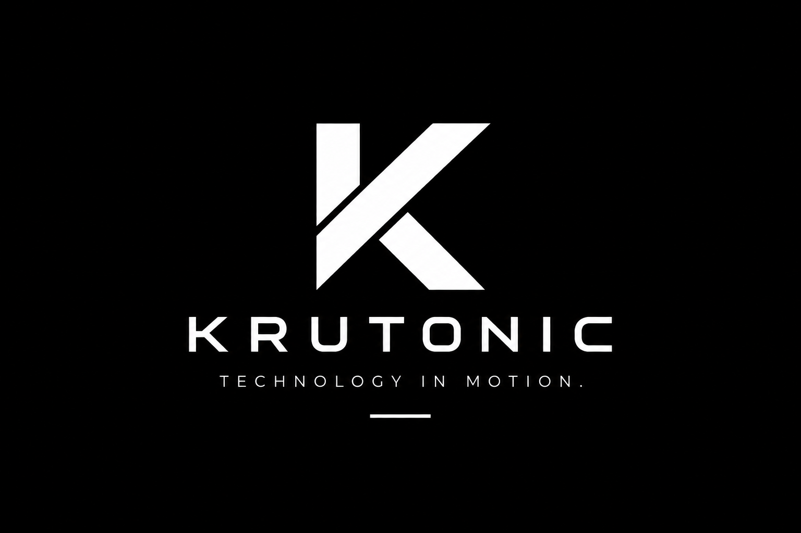

# KRUTONIC

  

  <strong>Technology in Motion.</strong>

  Building modern websites, mobile applications, and scalable digital solutions.

  <a href="https://krutarthchauhan.co.in">Website</a>
  •
  <a href="mailto:krutarthchauhan2000@gmail.com">Contact Us</a>

---

## About KRUTONIC

KRUTONIC is a software development brand focused on turning ideas into modern, reliable, and scalable digital products.

We build websites, mobile applications, backend systems, and custom software solutions using modern technologies and thoughtful design.

From concept to deployment, we focus on creating technology that is practical, performant, and built for the future.

> Ideas into real solutions.

---

## What We Do

### Web Development

Modern, responsive, and high-performance websites and web applications.

* Business websites
* Custom web applications
* Landing pages
* Full-stack applications
* Responsive UI development

### Mobile App Development

Cross-platform mobile applications designed for real-world use.

* iOS applications
* Android applications
* Cross-platform mobile apps
* React Native applications
* Expo-based development

### Backend & API Development

Reliable backend systems and APIs to power modern digital products.

* REST APIs
* Authentication systems
* Database integration
* Server-side development
* Cloud-based backend solutions

### UI/UX & Digital Experiences

Clean, modern, and user-friendly interfaces that combine design with functionality.

---

## Technology Stack

### Frontend

  
  
  
  

### Mobile

  
  

### Backend & Cloud

  
  
  
  

### Tools & Workflow

  
  
  
  

---

## Our Approach

We believe great software is built through a clear process, strong communication, and continuous improvement.

| Stage         | What We Do                                              |
| ------------- | ------------------------------------------------------- |
| 01 — Discover | Understand the idea, goals, and requirements.           |
| 02 — Plan     | Define the roadmap and technical approach.              |
| 03 — Design   | Create intuitive and modern user experiences.           |
| 04 — Build    | Develop reliable software using the right technologies. |
| 05 — Test     | Focus on quality, performance, and functionality.       |
| 06 — Deploy   | Launch the product and support its growth.              |

---

## What We Value

**Clarity**
Understand the problem before building the solution.

**Quality**
Write maintainable, reliable, and thoughtful software.

**Innovation**
Use modern technologies to create better digital experiences.

**Scalability**
Build foundations that can evolve with your business.

**Client Focus**
Keep communication, collaboration, and real-world needs at the center.

---

## Our Projects

We are building digital solutions across web, mobile, and backend technologies.

Our work includes:

* Custom websites and web applications
* Mobile applications
* Backend and API systems
* Business automation tools
* Custom digital products

More projects and case studies will be shared here as our portfolio grows.

---

## Let's Build Something Amazing

Have an idea, a project, or a business problem that needs a digital solution?

We would love to hear from you.

  <strong>KRUTONIC — Technology in Motion.</strong>

  <a href="https://krutarthchauhan.co.in">Visit Our Website</a>
   
   
  Email: <a href="mailto:krutarthchauhan2000@gmail.com">krutarthchauhan2000@gmail.com</a>
   
  Phone: +91 8160032383

  © KRUTONIC. All rights reserved.

# .github
